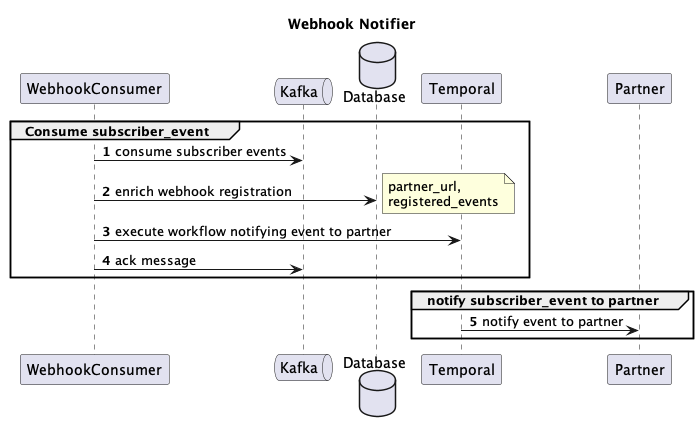

# Webhook Service
Handling webhook and notify to partner the corresponding events

## Documentation



## Technical Stack
Programming Language: Golang\
Database: MySQL\
Message Broker: Kafka\
[Temporal](https://temporal.io) for handling retryable activities

## Project structure
```
┣ cmd: init system with cli
┣ docs: repository's documentation
┣ pkg: repository's package
┣ internal
┃ ┣ adapters: layer to define traffic going out of system
┃ ┣ app: appliation logic
┃ ┣ common: common definition share between multiple flows
┃ ┣ entities: domain entities
┃ ┣ ports: layer to define traffic comming to system
┃ ┃ ┣ kafka_consumer
┃ ┃ ┗ temporal_worker
┃ ┣ service: init dependencies of application
┃ ┃ ┗ application.go
```

## Installation
```bash
make docker-compose-up
```

## Characteristics
This system is designed with the following characteristics:
- **Reliability**: Utilizing Temporal for handling failures and ensuring recoverability.
- **Scalability**: Capable of handling increased workload by adding more application instances.

## Monitoring
Prometheus and Grafana are integrated to provide comprehensive monitoring and visualization of the system's performance and latency metrics.

### Accessing Monitoring Tools
- **Grafana**: Available at [http://localhost:3000/](http://localhost:3000/)
- **Temporal Admin Tool**: Accessible via [http://localhost:8080/](http://localhost:8080/)

### Load Test
- Update property env in config/local.yaml to run system under load testing option
- Running command in docker compose file to trigger producing 100 Kafka messages or more with configurable
service name: **produce_batch_kafka_messages**
- Currently, each trigger action will produce 1000 messages to Kafka(also notify to partner). 
- Event send to partner will be randomly processing between 0-10s(configurable), error rate 5% (configurable)
- Request failed will be retried automatically


 
